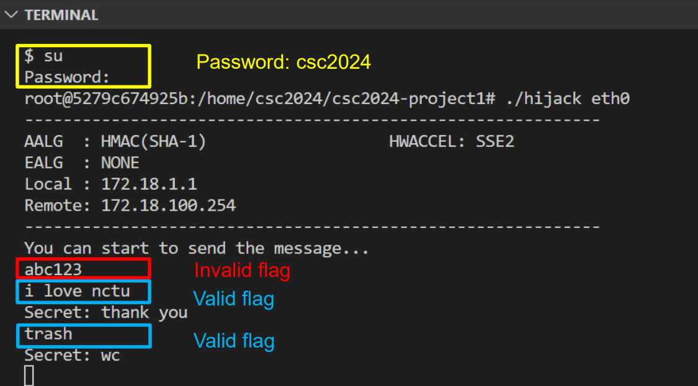
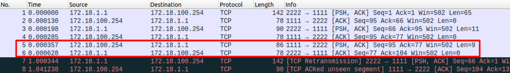

<a name="readme-top"></a>

<!-- PROJECT LOGO -->
<h3 align="center">CSC Project1 - IPSec Session Hijacking</h3>
<p>
This project in C++ revolves around IPsec transport mode session hijacking between client and server Docker containers, entailing real-time monitoring, data collection, and crafting of IPsec/TCP packets
</p>

<!-- TABLE OF CONTENTS -->
<details>
  <summary>Table of Contents</summary>
  <ol>
    <li>
      <a href="#about-the-project">About The Project</a>
    </li>
    <li>
      <a href="#getting-started">Getting Started</a>
    </li>
    <li><a href="#usage">Usage</a></li>
    <li><a href="#verification-steps">Verification Steps</a></li>
    <li><a href="#environment">Environment</a></li>
    <ul>
        <li><a href="#ip-address">IP Address</a></li>
        <li><a href="#configuration">Configuration</a></li>
    </ul>
    <li><a href="#license">License</a></li>
  </ol>
</details>


<!-- ABOUT THE PROJECT -->
## About The Project
<p>
    This project focuses on IPsec transport mode session hijacking using two Docker containers designated as the client and the server. The aim is to establish an IPsec/TCP session between them and develop an attacker program on the client side to perform hijacking. This project is implemented in C++ and involves real-time monitoring, information collection, and crafting of IPsec/TCP packets. Verification steps are outlined to ensure the successful execution of the hijacking process.
</p>

<p align="right">(<a href="#readme-top">back to top</a>)</p>


<!-- GETTING STARTED -->
## Getting Started

This is an example of how you may give instructions on setting up your project locally.
To get a local copy up and running follow these simple example steps.

### Build the project1 image
You need to install the docker at first,
 and build the project1 image with
```bash
sudo docker build -t csc2024-project1 -f csc2024-project1.Dockerfile .
```

### Run the project1 containers

Run the server and client with
```bash
sudo docker-compose -f csc2024-project1-docker-compose.yml up -d
```

Noted that if there is already a docker network of `172.18.0.0/16` in your environment, delete it at first.


Otherwise, you will encounter the error below:
```bash
✘ Network csc2024-project1-docker_IPSec  
Error                                                      0.0s
failed to create network csc2024-project1-docker_IPSec: Error response from daemon: Pool overlaps with other one on this address space
```
<p align="right">(<a href="#readme-top">back to top</a>)</p>

<!-- USAGE EXAMPLES -->
## Usage

### Run the server

In the server container, 

run the server with
```bash
docker exec -it server bash
./server 1111
```

### Run the client

In the client container, 

run the client with
```bash
docker exec -it client bash
./client 172.18.100.254 1111 2222
```
### Run the hijacking tool
In the client container, 

create the hijacking tool and run the hijacking tool with
```bash
docker exec -it client bash
make
./hijack eth0
```

### Stop and remove the containers

After testing, you can remove the docker network (csc-project1-docker_IPSec) and the client/server containers with 
```bash
sudo docker-compose -f csc2024-project1-docker-compose.yml down
```

### Remove the image

After testing, you can remove the docker image (csc2024-project1) with
```bash
docker rmi csc2024-project1
```

### Restart the container 

If the container exited after rebooting,
restart the container with
```bash
docker restart $container_name
```

<p align="right">(<a href="#readme-top">back to top</a>)</p>

## Verification Steps
1. <a href="#run-the-server">Run the server container</a> and <a href="#run-the-server">run the client container</a> first.
2. <a href="#run-the-hijacking-tool">Start the hijacking tool</a> in the client container.

3. (Optional) Start the wireshark to capture the IPsec packets.

4. Send messages in `project1/csc2024-project1/scripts/answer.txt` to retrieve flags. For example, you can send the message `i love nctu` to receive the flag `thank you`.


5. (Optional) You can check the wireshark to see fabricated IPsec packets.
  - Make sure that you have modify the preferences in wireshark to enable dissecting of raw data.


<p align="right">(<a href="#readme-top">back to top</a>)</p>

## Environment

### IP address

In the default setting of the docker-compose, 
- The IP address of server is `172.18.100.254:1111`
- The IP address of client is `172.18.1.1:2222`
- The external port to access SSH in the server is `3333`
- The external port to access SSH in the client is `4444`

### Configuration
The script `csc2024-project1/scripts/config.sh` will depend on the setting of the docker-compose


<p align="right">(<a href="#readme-top">back to top</a>)</p>

<!-- LICENSE -->
## License

Distributed under the MIT License. See `project1/csc2024-project1/LICENSE` for more information.

<p align="right">(<a href="#readme-top">back to top</a>)</p>
